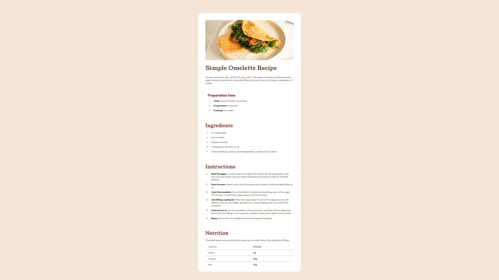

# Frontend Mentor - Recipe page

This is a solution to the [Recipe page challenge on Frontend Mentor](https://www.frontendmentor.io/challenges/recipe-page-KiTsR8QQKm).

## Screenshot

- Live Site URL: [https://iambraga.github.io/recipe-page/](https://iambraga.github.io/recipe-page/)

## Built with

- Semantic HTML5 markup
- CSS properties

## Author

- Website - [Eduardo Braga](https://github.com/iambraga)
- Frontend Mentor - [@iambraga](https://www.frontendmentor.io/profile/iambraga)
